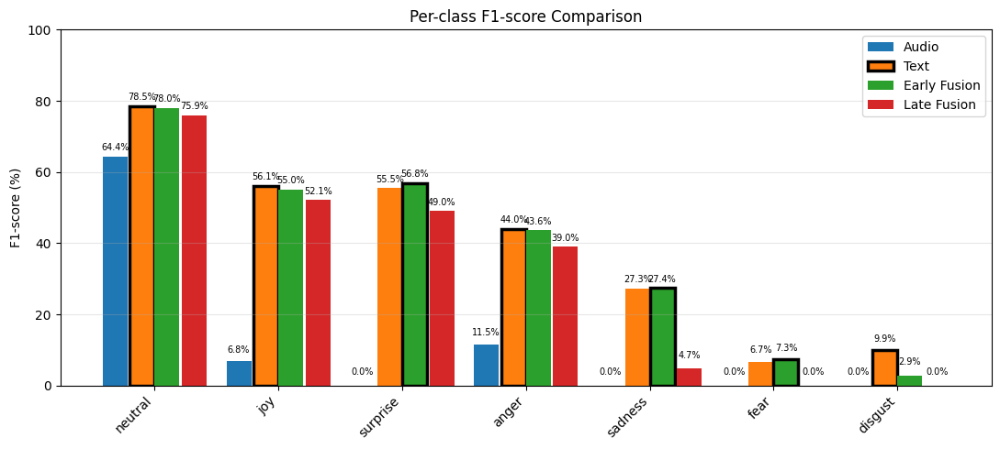
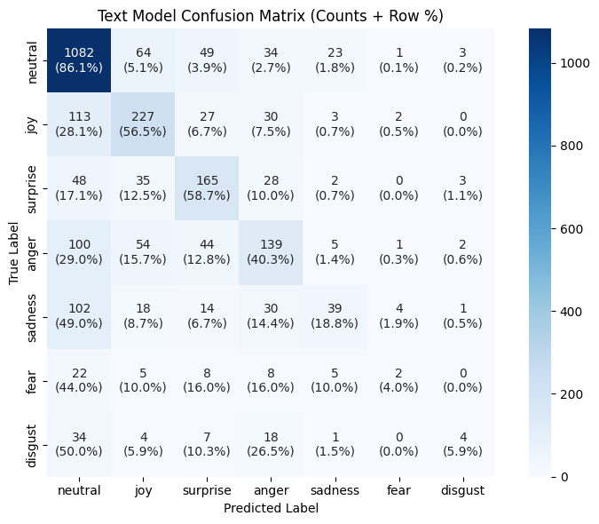
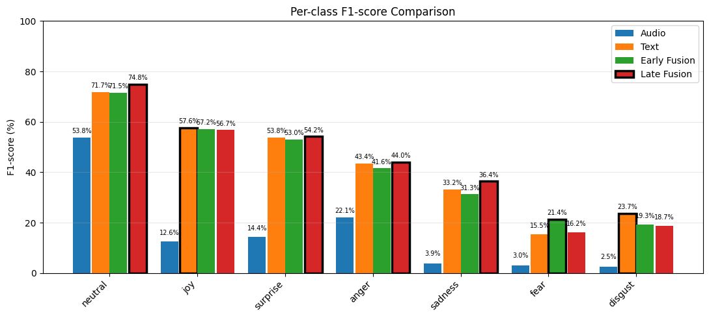
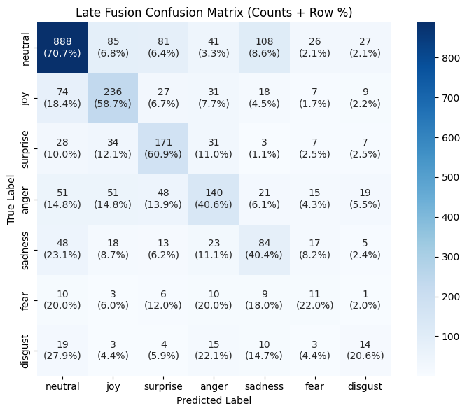
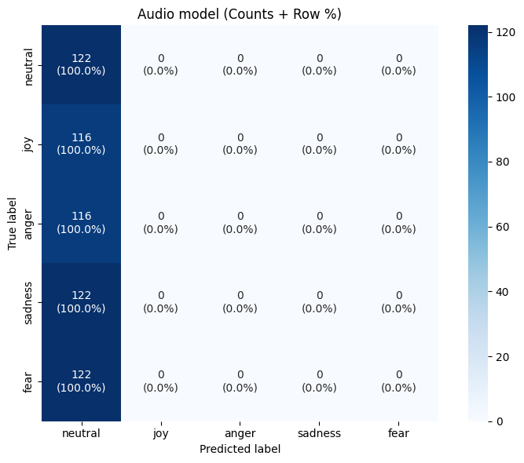
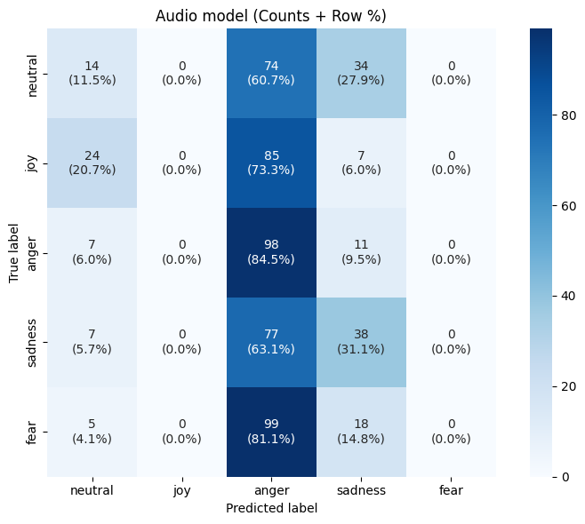
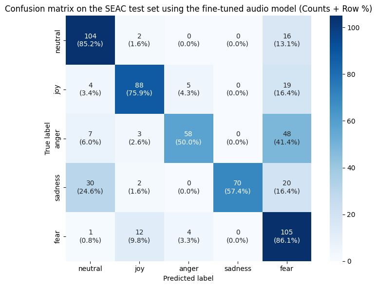
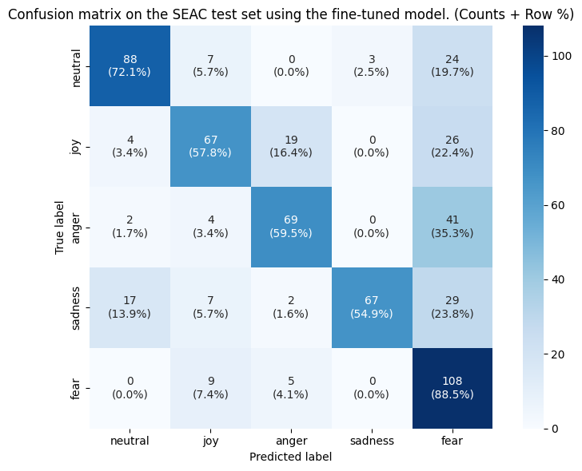
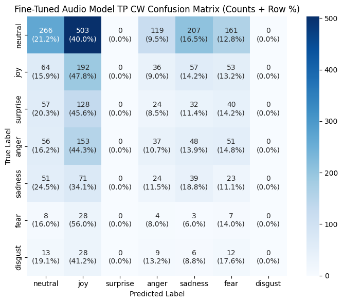

# RESULTS.md

## Overview

This file summarizes evaluation results for all major experiments performed in this repository.

The experiments cover:
* MELD baseline models
* MELD models with temporal pooling and class weighting
* Cross-dataset evaluation on SEAC
* Fine-tuned SEAC audio models
* Cross-speaker and cross-dataset testing

---

## Metrics

All models are evaluated using:
* **Accuracy**
* **Weighted F1-score**
* Confusion matrix
* Per-class F1-score (visualized in notebooks)

---
# 1. MELD RESULTS

## 1.1 Baseline Models (No Temporal Pooling, No Class Weights)

| Model                 | Accuracy  | Weighted F1|
|-----------------------|-----------|------------|
| Audio Baseline        | **0.4705**| **0.3353** |
| Text Baseline         | **0.6352**| **0.6076** |
| Early Fusion Baseline | **0.6356**| **0.6030** |
| Late Fusion Baseline  | **0.6165**| **0.5539** |

### Per-Class F1 (Baseline)

### Confusion Matrix — Best Baseline Model

---

## 1.2 Improved Models (Temporal Pooling + Class Weights)

| Model         | Temporal Pooling | Class Weights | Accuracy   | Weighted F1|
|---------------|------------------|---------------|------------|------------|
| Audio         | ✅               | ✅           | **0.3483** | **0.3276** |
| Text          | ❌               | ✅           | **0.5647** | **0.5849** |
| Early Fusion  | ✅               | ✅           | **0.5640** | **0.6009** |
| Late Fusion   | ✅               | ✅           | **0.5916** | **0.6009** |

### Per-Class F1 (Improved)

### Confusion Matrix — Best TP + CW Model

---

## 1.3 Improvement over Baseline

| Model         | Baseline F1 | TP + CW F1 | Improvement |
|---------------|-------------|------------|-------------|
| Audio         | 0.3353      | 0.3276     | **-0.0077** |
| Text          | 0.6076      | 0.5849     | **-0.0227** |
| Early Fusion  | 0.6030      | 0.6009     | **-0.0021** |
| Late Fusion   | 0.5539      | 0.6009     | **+0.0470** |

### Analysis

- The impact of **temporal pooling (TP)** and **class weighting (CW)** varies across modalities.
- Audio-only performance slightly decreases, indicating that temporal pooling and class weighting do not provide clear benefits on MELD when the domain remains unchanged.
- Text performance remains stable, indicating lower sensitivity to class imbalance.
- Fusion models, especially late fusion, benefit the most — showing improved robustness and better handling of minority classes.
- **TP + CW does not universally improve performance on MELD**, but it **significantly benefits late fusion**, indicating that temporal dynamics in audio become more useful when fused at the decision level rather than feature level. These findings motivated further **SEAC fine-tuning and domain adaptation experiments**.

---

# Cross-Dataset Evaluation (MELD → SEAC)

Audio models trained on MELD were evaluated on unseen SEAC speakers to measure cross-dataset generalization under domain shift (English → Serbian).

| Model                 | Temporal Pooling | Class Weights   | Accuracy   | Weighted F1|
|-----------------------|------------------|-----------------|------------|------------|
| MELD Audio Baseline   | ❌               | ❌             | **0.2040** | **0.0691** |
| MELD Audio (TP + CW)  | ✅               | ✅             | **0.2508** | **0.1686** |

### Confusion Matrix — MELD Audio Baseline (MELD → SEAC)

### Confusion Matrix — MELD Audio (TP + CW) (MELD → SEAC)

### Analysis

- Cross-dataset performance is very low for both models, confirming a strong domain shift between English conversational emotions (MELD) and Serbian acted speech (SEAC).
- The baseline model collapses toward dominant emotion classes, resulting in extremely low Weighted F1.
- Adding temporal pooling and class weighting significantly improves F1 (0.069 → 0.168), showing:
    - better handling of minority classes
    - slightly improved class balance
- Despite improvement, generalization remains poor, indicating that: language mismatch, acoustic differences and speaker distribution shift strongly affect performance.
- These results motivated domain adaptation via SEAC fine-tuning, presented in the next section.

---

# SEAC Fine-Tuning (Domain Adaptation)

Audio models initialized from MELD were fine-tuned on SEAC using the remaining speakers to perform domain adaptation and improve cross-speaker robustness.

## Fine-Tuned Audio — Baseline and Temporal Pooling + Class Weights
| Model                         | Temporal Pooling | Class Weights   | Accuracy   | Weighted F1|
|-------------------------------|------------------|-----------------|------------|------------|
| Fine-Tuned Audio Baseline     | ❌               | ❌             | **0.7107** | **0.7130** |
| Fine-Tuned Audio (TP + CW)    | ✅               | ✅             | **0.6672** | **0.6730** |

### Confusion Matrix — Fine-Tuned Audio Baseline

### Confusion Matrix — Fine-Tuned Audio (TP + CW)

### Analysis
- Fine-tuning on SEAC leads to a large performance improvement compared to MELD→SEAC zero-shot transfer, confirming successful domain adaptation.
- The fine-tuned baseline model achieves the best overall performance (F1 = 0.713), indicating that SEAC is relatively well balanced and easier to model after adaptation.
- Adding temporal pooling and class weighting slightly decreases performance, suggesting:
    - class imbalance is less severe after fine-tuning
    - temporal aggregation may smooth useful emotional cues
- Both models show strong cross-speaker generalization, significantly outperforming the MELD-trained models evaluated on SEAC.
- Performance remains much higher than MELD→SEAC transfer, confirming that domain mismatch (language + acoustics) was the primary limitation.

---

# Cross-Dataset Back-Transfer (SEAC → MELD)

Fine-tuned SEAC models were evaluated back on the original MELD test set to assess cross-domain retention after domain adaptation.

| Model                         | Temporal Pooling  | Class Weights  | Accuracy   | Weighted F1|
|-------------------------------|-------------------|----------------|------------|------------|
| Fine-Tuned Audio Baseline     | ❌                | ❌            | **0.1893** | **0.1895** |
| Fine-Tuned Audio (TP + CW)    | ✅                | ✅            | **0.2073** | **0.2112** |

### Confusion Matrix — Back-Transfer (Best Model)

### Analysis

- Strong specialization to the SEAC domain is observed.
- Performance drop on MELD confirms the domain adaptation trade-off.
- The model adapts to Serbian acoustic and emotional patterns, reducing cross-domain robustness.
- This behaviour suggests partial catastrophic forgetting of MELD-specific characteristics.
- Temporal pooling slightly improves stability but does not prevent domain specialization.

---

# Model Comparison

| Model                                 | Temporal Pooling  | Class Weights | Accuracy   | Weighted F1 |
|---------------------------------------|------------------ |---------------|------------|-------------|
| MELD Audio Baseline                   | ❌                | ❌           | **0.4705** | **0.3353**  |
| MELD Audio (TP + CW)                  | ✅                | ✅           | **0.3483** | **0.3276**  |
| MELD → SEAC (no fine-tuning)          | ❌                | ❌           | **0.2040** | **0.0691**  |
| MELD → SEAC (no fine-tuning, TP + CW) | ✅                | ✅           | **0.2508** | **0.1686**  |
| Fine-Tuned Audio Baseline             | ❌                | ❌           | **0.7107** | **0.7130**  |
| Fine-Tuned Audio (TP + CW)            | ✅                | ✅           | **0.6672** | **0.6730**  |
| SEAC → MELD                           | ❌                | ❌           | **0.1893** | **0.1895**  |
| SEAC → MELD (TP + CW)                 | ✅                | ✅           | **0.2073** | **0.2112**  |

---

# Key Conclusions

- Domain shift between MELD (English) and SEAC (Serbian) is substantial.
- MELD-trained models generalize poorly to SEAC without adaptation.
- Fine-tuning on SEAC significantly improves accuracy, class balance, and cross-speaker robustness.
- Temporal pooling combined with class weighting improves stability and minority class performance.
- Fine-tuned models specialize to SEAC and lose performance on MELD, confirming a domain adaptation trade-off.
- Cross-dataset back-transfer reveals partial catastrophic forgetting of MELD-specific patterns.

---

# Visualizations

- Key visualizations included in this repository:
    - Confusion matrices (baseline, TP+CW, fine-tuned, back-transfer)
    - Per-class F1 comparisons across MELD models
    - Cross-dataset and fine-tuning performance comparisons
- Additional detailed plots are available in experiment notebooks.
---